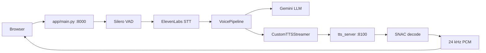

# STT-TTS Streaming Pipeline

Low-latency voice assistant: browser microphone → local VAD → ElevenLabs Scribe v2 Realtime STT → Gemini LLM → custom Indic TTS (GPU sidecar), with a web demo.

**TTS model:** [Mevearth2/Quantized-Merged-TTS](https://huggingface.co/Mevearth2/Quantized-Merged-TTS) (Orpheus + SNAC, 24 kHz PCM output).

## Quick start (Windows, native)

### 1. Install dependencies

```powershell
python -m venv .venv
.\.venv\Scripts\Activate.ps1
pip install -r requirements.txt
pip install -r tts_server/requirements.txt
pip install -r scripts/requirements-dev.txt
```

Download the TTS model to a local path (e.g. `C:\Model`) or set `TTS_MODEL_ID` to the Hugging Face repo id.

### 2. Configure `.env`

Copy `.env.example` to `.env` and set:

| Variable | Purpose |
|----------|---------|
| `GEMINI_API_KEY` | Gemini LLM |
| `ELEVENLABS_API_KEY` | STT only |
| `TTS_BACKEND=custom` | Use GPU sidecar for speech |
| `TTS_SERVICE_URL=http://localhost:8100` | Sidecar URL |
| `TTS_MODEL_ID=C:\Model` | Local model path (sidecar reads this) |
| `TTS_LOAD_IN_4BIT=true` | Required for 6 GB VRAM |

Set `TTS_BACKEND=elevenlabs` and `ELEVENLABS_VOICE_ID` to fall back to ElevenLabs TTS.

### 3. Smoke test TTS

```powershell
python scripts/smoke_test_tts.py
```

Expect: `OK: wrote smoke_test.wav`. First run downloads SNAC (~90 MB).

### 4. Run the full pipeline (two terminals)

**Terminal 1 — TTS sidecar** (start first; ~1–3 min model load):

```powershell
.\scripts\start-tts-sidecar.ps1
```

Verify: http://localhost:8100/health → `"status": "ok"`

**Terminal 2 — main app**:

```powershell
.\scripts\start-main-app.ps1
```

Open http://localhost:8000, allow microphone, tap mic, speak, pause ~0.4 s for VAD endpoint.

## Architecture



- **VAD:** Silero ONNX (`models/silero_vad.onnx`) or WebRTC fallback
- **STT:** ElevenLabs Realtime WebSocket, manual commit on local endpoint
- **LLM:** Gemini streaming per WebSocket session; replies in the user's detected language
- **TTS:** Transformers + BitsAndBytes 4-bit loader with incremental SNAC streaming

Language is auto-detected from the STT transcript and mapped to a default speaker (e.g. Hindi → speaker `159`, English → speaker `159`).

## Windows notes

- Pin **`transformers==4.53.1`** in `tts_server/requirements.txt` — version 5.x can crash during model load on Windows
- Close memory-heavy apps before starting the sidecar (model load needs RAM headroom)
- Never commit `.env` — use `.env.example` only

## Tuning latency

Lower values = faster first response, more cut-offs / choppier speech.

| Variable | Default | Effect |
|----------|---------|--------|
| `VAD_END_SILENCE_MS` | 400 | Silence before STT commit |
| `TTS_MIN_CHARS` | 6 | Min LLM chars before first TTS call |
| `TTS_SEGMENT_TIMEOUT_MS` | 100 | Max wait for phrase boundary |

The sidecar streams PCM incrementally as SNAC frames decode (every 7 audio tokens).

## Tests

```powershell
pytest tests/ -q
```

## Troubleshooting

| Symptom | Fix |
|---------|-----|
| Access violation on model load | `pip install "transformers==4.53.1"` |
| Paging file too small | Increase Windows virtual memory; close other apps |
| `STT connect failed` | Check `ELEVENLABS_API_KEY` |
| `TTS sidecar error 503` | Sidecar still loading — wait for `TTS server ready` |
| Text works, no audio | Sidecar not running or wrong `TTS_SERVICE_URL` |
| English speech → Hindi reply | Check main app logs for `voice_route language=...` |

## Remote GPU sidecar (cloud deploy)

Only the TTS sidecar moves to a GPU server; the main app can stay on your laptop.

### On the GPU server

1. Clone the repo and install `tts_server/requirements.txt`
2. Set in `.env`:
   ```
   TTS_MODEL_ID=/path/to/model
   TTS_LOAD_IN_4BIT=true
   ```
3. Start: `uvicorn tts_server.main:app --host 0.0.0.0 --port 8100`
4. Expose port 8100 (firewall / reverse proxy)

### On the laptop (main app)

Change one line in `.env`:

```
TTS_SERVICE_URL=https://your-gpu-host:8100
```

## Remote browser access

Expose port 8000 with Cloudflare Tunnel or `ngrok http 8000` (HTTPS required for mic on non-localhost).

## Gemini model list

```
python scripts/list_gemini_models.py
```
