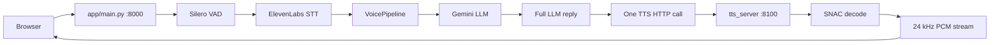

# STT-TTS Streaming Pipeline

Low-latency voice assistant: browser microphone → local VAD → ElevenLabs Scribe v2 Realtime STT → Gemini LLM → custom Indic TTS (GPU sidecar), with a web demo.

**TTS model:** [Mevearth2/Quantized-Merged-TTS](https://huggingface.co/Mevearth2/Quantized-Merged-TTS) (Orpheus + SNAC, 24 kHz PCM output).

## Quick start (Windows, native)

### 1. Install dependencies

```powershell
python -m venv .venv
.\.venv\Scripts\Activate.ps1
pip install -r requirements.txt
pip install -r tts_server/requirements.txt
pip install -r scripts/requirements-dev.txt
```

Download the TTS model to a local path (e.g. `C:\Model`) or set `TTS_MODEL_ID` to the Hugging Face repo id.

### 2. Configure `.env`

Copy `.env.example` to `.env` and set:

| Variable | Purpose |
|----------|---------|
| `GEMINI_API_KEY` | Gemini LLM |
| `ELEVENLABS_API_KEY` | STT only |
| `TTS_BACKEND=custom` | Use GPU sidecar for speech |
| `TTS_SERVICE_URL=http://localhost:8100` | Sidecar URL |
| `TTS_MODE=single` | **One TTS call per full LLM reply** (recommended) |
| `TTS_LATENCY_PROFILE=slow_gpu` | Local 4050: buffer then play. Use `fast_gpu` on RunPod |
| `TTS_MODEL_ID=C:\Model` | Local model path (sidecar reads this) |
| `TTS_LOAD_IN_4BIT=true` | Required for 6 GB VRAM |

Set `TTS_BACKEND=elevenlabs` and `ELEVENLABS_VOICE_ID` to fall back to ElevenLabs TTS.

### 3. Smoke test TTS

```powershell
python scripts/smoke_test_tts.py
```

Expect: `OK: wrote smoke_test.wav`. First run downloads SNAC (~90 MB).

### 4. Run the full pipeline (two terminals)

**Terminal 1 — TTS sidecar** (start first; ~1–3 min model load):

```powershell
.\scripts\start-tts-sidecar.ps1
```

Verify: http://localhost:8100/health → `"status": "ok"`

**Terminal 2 — main app**:

```powershell
.\scripts\start-main-app.ps1
```

Open http://localhost:8000, allow microphone, tap mic, speak, pause ~0.4 s for VAD endpoint.

## Architecture



- **VAD:** Silero ONNX (`models/silero_vad.onnx`) or WebRTC fallback
- **STT:** ElevenLabs Realtime WebSocket, manual commit on local endpoint
- **LLM:** Gemini streaming to UI; full reply sent to TTS once (`TTS_MODE=single`)
- **TTS:** Transformers + SNAC; one `/v1/tts/stream` POST per assistant turn

## Latency profiles

| Profile | Main app | Sidecar | Playback |
|---------|----------|---------|----------|
| `balanced` (default) | `TTS_LATENCY_PROFILE=balanced` | `TTS_DECODE_MODE=buffered` | Stream PCM to browser during generation; client plays on end (fluent on RTX 4050) |
| `slow_gpu` | `TTS_LATENCY_PROFILE=slow_gpu` | `TTS_DECODE_MODE=buffered` | Server buffers all PCM before send — same fluency, higher server memory |
| `fast_gpu` | `TTS_LATENCY_PROFILE=fast_gpu` | `TTS_DECODE_MODE=cumulative` | End-to-end streaming when GPU beats realtime (RunPod 4090+) |

Other tuning:

| Variable | Default | Effect |
|----------|---------|--------|
| `TTS_MODE` | `single` | `single` = one TTS per reply; `segment` = early multi-call (legacy) |
| `VAD_END_SILENCE_MS` | 400 | Silence before STT commit |
| `GEMINI_MODEL` | `gemini-2.0-flash-lite` | LLM speed |

Check pipeline logs for `tts_request_count=1` and `time_to_first_audio`.

## Tests

```powershell
pytest tests/ -q
python scripts/verify_e2e.py
python scripts/verify_e2e.py --benchmark
```

## Troubleshooting

| Symptom | Fix |
|---------|-----|
| Access violation on model load | `pip install "transformers==4.53.1"` |
| Paging file too small | Increase Windows virtual memory; close other apps |
| `STT connect failed` | Check `ELEVENLABS_API_KEY` |
| `stt_error quota` | Refresh ElevenLabs quota; STT is muted during TTS playback |
| `TTS sidecar error 503` | Sidecar still loading — wait for `TTS server ready` |
| `tts_request_count` > 1 | Set `TTS_MODE=single` |
| Choppy speech on 4050 | Use `TTS_LATENCY_PROFILE=slow_gpu` |
| High latency on 4050 | Expected; move sidecar to RunPod 4090+ |

## Remote GPU sidecar (RunPod)

Only the TTS sidecar runs on the GPU pod; main app + browser stay on your laptop.

### On the RunPod GPU (4090 24GB+ recommended)

1. Clone repo, install `tts_server/requirements.txt`
2. Set in pod `.env`:
   ```
   TTS_MODEL_ID=/workspace/model
   TTS_LOAD_IN_4BIT=false
   TTS_DECODE_MODE=cumulative
   TTS_STREAM_DECODE_FRAMES=2
   TTS_PCM_CHUNK_MS=200
   ```
3. Start:
   ```bash
   bash scripts/start-tts-sidecar-runpod.sh
   ```
4. Expose port 8100 (RunPod TCP proxy or HTTPS tunnel)

### On the laptop (main app)

```
TTS_SERVICE_URL=https://your-pod-host:8100
TTS_MODE=single
TTS_LATENCY_PROFILE=fast_gpu
```

## Remote browser access

Expose port 8000 with Cloudflare Tunnel or `ngrok http 8000` (HTTPS required for mic on non-localhost).

## Gemini model list

```
python scripts/list_gemini_models.py
```
