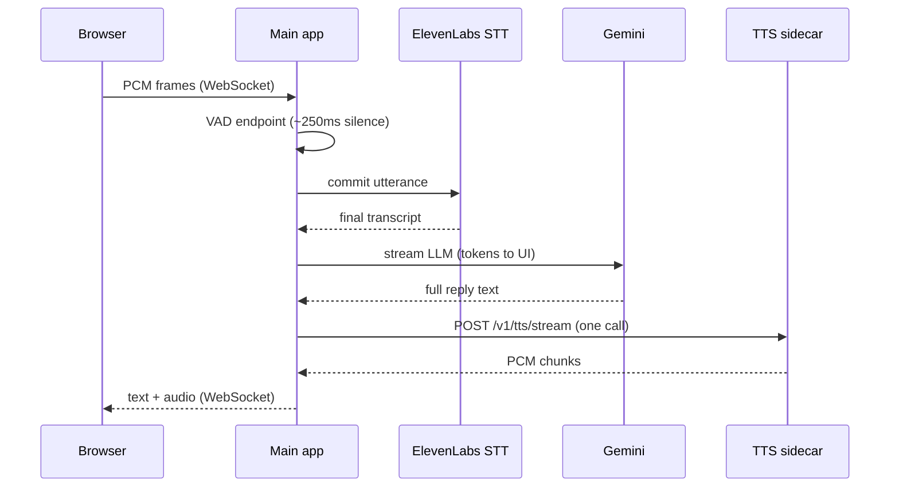

# STT-TTS Voice Pipeline

Real-time voice assistant with a browser UI: microphone → local VAD → ElevenLabs STT → Gemini LLM → custom Indic TTS (SNAC), streamed back as 24 kHz PCM.

The stack splits into two processes:

| Process | Port | Role |
|---------|------|------|
| **Main app** (`app/`) | 8000 | WebSocket server, VAD, STT client, LLM, TTS HTTP client, static UI |
| **TTS sidecar** (`tts_server/`) | 8100 | GPU inference only — Orpheus-style model + SNAC decode |

The main app can run on your laptop while the sidecar runs locally or on a remote GPU host (e.g. RunPod).

**TTS model:** [Mevearth2/Quantized-Merged-TTS](https://huggingface.co/Mevearth2/Quantized-Merged-TTS) (LLaMA 3B + SNAC, 24 kHz mono PCM). Same family as [snorTTS-Indic-v0](https://huggingface.co/snorbyte/snorTTS-Indic-v0); see `Context/` for training and inference references.

---

## How a turn works



1. **VAD** detects end of speech and cuts an utterance (WebRTC fallback, or Silero ONNX if `models/silero_vad.onnx` is present).
2. **STT** commits the utterance to ElevenLabs Scribe v2 Realtime; partial transcripts stream to the UI.
3. **Language routing** picks TTS language, speaker ID, and speed from script detection or STT hint (9 Indic languages + English).
4. **LLM** streams Gemini tokens to the browser, then the **full reply** is sent to TTS once (`TTS_MODE=single`).
5. **TTS sidecar** generates SNAC audio tokens, decodes to PCM, streams HTTP chunks to the main app.
6. **Browser** plays PCM via Web Audio (`client/web/pcm-player.js`).

While the assistant pipeline is running, new mic utterances are **dropped** (`utterance_dropped voice_pipeline_busy`). STT PCM forwarding is paused during playback. Speaking during assistant audio triggers **barge-in** (cancels current pipeline).

---

## Repository layout

```
app/                    Main FastAPI app + voice pipeline
  main.py               WebSocket handler, VAD, STT, pipeline orchestration
  voice_pipeline.py     LLM → TTS, latency profiles, metrics
  gemini_streamer.py    Gemini streaming (thinking_budget=0)
  custom_tts_streamer.py HTTP client to TTS sidecar
  language_router.py    Script/STT → language + speaker + speed
  vad.py                Silero / WebRTC VAD
  config.py             pydantic-settings from .env

tts_server/             GPU TTS sidecar (FastAPI)
  main.py               POST /v1/tts/stream, GET /health
  engine.py             Transformers + SNAC streaming decode
  config.py             Sidecar env (reads repo-root .env)

client/web/             Browser demo (index.html, app.js, pcm-player.js)

scripts/
  start-main-app.ps1    Main app (Windows)
  start-tts-sidecar.ps1 Local TTS sidecar (Windows)
  start-tts-sidecar-runpod.sh  TTS sidecar (Linux / RunPod)
  smoke_test_tts.py     TTS-only WAV output
  verify_e2e.py         Health checks + optional TTS benchmark

tests/                  pytest unit tests
Context/                TTS model docs and reference training script
```

---

## Prerequisites

- Python 3.10+
- **API keys:** `GEMINI_API_KEY`, `ELEVENLABS_API_KEY` (STT)
- **GPU** for TTS sidecar (local machine or remote pod)
- Windows for local dev scripts; Linux for RunPod sidecar

---

## Setup

### 1. Install dependencies

```powershell
python -m venv .venv
.\.venv\Scripts\Activate.ps1
pip install -r requirements.txt
pip install -r tts_server/requirements.txt
pip install -r scripts/requirements-dev.txt   # optional: smoke_test WAV output
```

On the TTS host (Linux / RunPod), also install SoX for optional speed adjustment:

```bash
apt-get update && apt-get install -y sox libsox-dev
```

### 2. Configure environment

```powershell
copy .env.example .env
```

Edit `.env` and **save the file** before starting servers. The main app logs active config at startup:

```text
tts_config backend=custom url=... profile=fast_gpu mode=single
```

Verify `url` and `profile` match what you intended.

### 3. Download TTS model

Place a merged Orpheus/SNAC TTS checkpoint on the **sidecar host** (local path or Hugging Face id). Set `TTS_MODEL_ID` in the sidecar environment.

---

## Configuration

### Main app `.env` (laptop or single-machine setup)

| Variable | Example | Purpose |
|----------|---------|---------|
| `GEMINI_API_KEY` | | Gemini LLM |
| `GEMINI_MODEL` | `gemini-2.0-flash-lite` | Fast short replies |
| `ELEVENLABS_API_KEY` | | STT (required) |
| `ELEVENLABS_STT_MODEL_ID` | `scribe_v2_realtime` | Realtime STT model |
| `TTS_BACKEND` | `custom` | `custom` = sidecar; `elevenlabs` = cloud TTS fallback |
| `TTS_SERVICE_URL` | see below | Sidecar base URL |
| `TTS_MODE` | `single` | `single` = one TTS call per reply (recommended) |
| `TTS_LATENCY_PROFILE` | `fast_gpu` | Playback strategy (see below) |
| `VAD_END_SILENCE_MS` | `250` | Silence after speech before STT commit |
| `HOST` / `PORT` | `0.0.0.0` / `8000` | Main app bind |

**`TTS_SERVICE_URL` examples:**

```env
# Local sidecar
TTS_SERVICE_URL=http://localhost:8100

# Remote sidecar (RunPod HTTP proxy)
TTS_SERVICE_URL=https://your-pod-id-8100.proxy.runpod.net
```

When using a remote URL, do **not** run the local TTS sidecar.

`SARVAM_*` keys in `.env.example` are reserved for optional alternate STT — not wired in the current pipeline.

### TTS sidecar `.env` (GPU host)

Set on the machine that runs `tts_server` (can be the same `.env` file in the repo root — the sidecar loads it via `tts_server/config.py`).

| Variable | Local dev | Remote GPU |
|----------|-----------|------------|
| `TTS_MODEL_ID` | `C:\Model` or HF id | `/workspace/model` |
| `TTS_LOAD_IN_4BIT` | `true` if VRAM is tight | `false` (bf16) |
| `TTS_DECODE_MODE` | `buffered` | `cumulative` |
| `TTS_STREAM_DECODE_FRAMES` | `4` | `2` |
| `TTS_PCM_CHUNK_MS` | `400` | `200` |
| `TTS_HOST` | `0.0.0.0` | `0.0.0.0` |
| `TTS_PORT` | `8100` | `8100` |

---

## Running

### Option A — Everything local (two terminals)

**Terminal 1 — TTS sidecar** (wait for `TTS server ready`, ~1–3 min first load):

```powershell
.\scripts\start-tts-sidecar.ps1
```

Health: http://localhost:8100/health → `{"status":"ok",...}`

**Terminal 2 — main app:**

```powershell
.\scripts\start-main-app.ps1
```

Open http://localhost:8000 → allow microphone → tap mic → speak → pause briefly for VAD.

Recommended local profile: `TTS_LATENCY_PROFILE=balanced` or `slow_gpu` if streaming sounds choppy.

### Option B — Remote TTS (RunPod) + local main app

**On the GPU pod:**

```bash
git clone <repo-url> && cd STT-TTS
pip install fastapi uvicorn pydantic numpy snac python-dotenv transformers==4.53.1 accelerate
# Do not pip-install torch if the pod image already has a compatible CUDA build.

# .env on pod: TTS_MODEL_ID, TTS_LOAD_IN_4BIT=false, TTS_DECODE_MODE=cumulative, etc.
bash scripts/start-tts-sidecar-runpod.sh
```

Expose port **8100** via the pod’s HTTP/TCP proxy.

**On your laptop:**

```env
TTS_SERVICE_URL=https://your-pod-id-8100.proxy.runpod.net
TTS_LATENCY_PROFILE=fast_gpu
TTS_MODE=single
```

```powershell
.\scripts\start-main-app.ps1
```

Use a RunPod PyTorch image with CUDA 12.8+ if the pod GPU requires it (e.g. recent NVIDIA architectures).

---

## Latency profiles

Profiles control **how PCM is buffered** between the sidecar, main app, and browser. They do not change sidecar generation — pair them with the sidecar `TTS_DECODE_MODE` below.

| Profile | Main app behavior | Client playback | Typical use |
|---------|-------------------|-----------------|-------------|
| `fast_gpu` | Forwards PCM to browser as it arrives | Streams with small prebuffer | Remote GPU or any host that generates faster than playback |
| `balanced` | Forwards PCM during generation | Buffers until `audio end`, then plays once | Local GPU that cannot keep up with streaming — avoids choppy gaps |
| `slow_gpu` | Holds all PCM server-side until TTS completes | Plays on end | Maximum fluency on slow local GPUs |

| Sidecar `TTS_DECODE_MODE` | Behavior |
|---------------------------|----------|
| `cumulative` | Decode SNAC incrementally; emit new samples as tokens generate (lower time-to-first-byte) |
| `buffered` | Single SNAC decode after full generation (matches reference training-script inference) |

**Recommended pairings:**

| Deployment | Main app | Sidecar |
|------------|----------|---------|
| Remote GPU (RunPod) | `fast_gpu` | `cumulative`, `TTS_PCM_CHUNK_MS=200` |
| Local GPU, choppy with `fast_gpu` | `balanced` | `buffered` |
| Local GPU, maximum fluency | `slow_gpu` | `buffered` |

### Pipeline metrics (main app terminal)

After each turn, `voice_pipeline` logs:

| Metric | Meaning |
|--------|---------|
| `stt_commit_seconds` | ElevenLabs STT commit time (logged by `main`, before pipeline) |
| `time_to_llm_end` | LLM full reply ready |
| `time_to_tts_request` | TTS HTTP call started |
| `time_to_tts_first_chunk` | First PCM from sidecar |
| `time_to_first_audio` | First PCM sent to browser |
| `tts_request_count` | Should be **1** with `TTS_MODE=single` |
| `total_pipeline_time` | Pipeline start → end (excludes STT) |

End-to-end perceived latency ≈ `stt_commit_seconds` + `total_pipeline_time` (plus VAD silence wait).

---

## TTS modes

| `TTS_MODE` | Behavior |
|------------|----------|
| `single` (default) | Wait for full LLM reply → one `POST /v1/tts/stream` → best quality and stable metrics |
| `segment` | `TextSegmenter` splits LLM stream → one TTS call per segment → lower latency risk, multiple HTTP calls |

Tune segment mode with `TTS_MIN_CHARS`, `TTS_SEGMENT_TIMEOUT_MS`, `TTS_IDEAL_MAX_CHARS`, `TTS_HARD_MAX_CHARS`.

---

## Multilingual voices

`language_router.py` maps transcript script (or STT language hint) to TTS prompt language and default speaker:

Hindi, Tamil, Bengali, Malayalam, Kannada, Telugu, Punjabi, Gujarati, Marathi, English.

Gemini is instructed to reply in the same language the user spoke. TTS uses Orpheus-style prompts: `{language}{speaker_id}: {utterance}`.

---

## Scripts

| Script | Purpose |
|--------|---------|
| `scripts/smoke_test_tts.py` | Load sidecar engine, write `smoke_test.wav` |
| `scripts/verify_e2e.py` | `GET /health` + main app; add `--benchmark` for TTS first-byte timing |
| `scripts/list_gemini_models.py` | List available Gemini models for your API key |

```powershell
python scripts/smoke_test_tts.py --text "नमस्ते" --language hindi --speaker 159
python scripts/verify_e2e.py https://your-pod-8100.proxy.runpod.net http://localhost:8000 --benchmark
pytest tests/ -q
```

---

## WebSocket protocol (summary)

**Client → server:** binary PCM (16 kHz mono); JSON `{"type":"start"}` / `{"type":"stop"}` for mic.

**Server → client:**

| Message | Description |
|---------|-------------|
| `{"type":"text","role":"stt_partial",...}` | Live STT |
| `{"type":"text","role":"stt_final",...}` | Committed transcript |
| `{"type":"text","role":"llm",...}` | LLM tokens (`partial: true` while streaming) |
| `{"type":"audio","event":"start","format":"audio/pcm;...","buffer_until_end":...}` | Audio playback start |
| binary frames | Raw Int16 PCM @ 24 kHz |
| `{"type":"audio","event":"end"}` | Utterance complete; client flushes buffer if needed |
| `{"type":"audio","event":"barge"}` | User interrupted assistant |
| `{"type":"ready"}` | Ready for next turn |
| `{"type":"vad","event":"endpoint"}` | VAD cut point |

---

## Troubleshooting

| Symptom | What to check |
|---------|----------------|
| Startup shows wrong `url` or `profile` | Save `.env`; restart main app; check startup `tts_config` line |
| `stt_error quota` / slow `stt_commit_seconds` | ElevenLabs quota; STT adds seconds **before** the pipeline starts |
| `TTS sidecar error 503` | Sidecar still loading — wait for `TTS server ready` |
| `tts_request_count` > 1 | Set `TTS_MODE=single` |
| Choppy audio with `fast_gpu` | GPU cannot keep up — use `balanced` + sidecar `buffered` |
| `utterance_dropped voice_pipeline_busy` | Spoke again while assistant was still processing — wait for `ready` |
| `audio_queue full, dropping chunk` | Mic still sending during long playback — turn off mic or wait for pipeline to finish |
| Access violation on model load | `pip install "transformers==4.53.1"` |
| Remote TTS fails | `curl https://your-pod/health` from laptop; confirm port 8100 exposed |
| No audio, `tts_request_count=0` | LLM returned empty or pipeline cancelled mid-run |

---

## Remote browser access

The demo expects http://localhost:8000. For HTTPS/mic on other hosts, tunnel port 8000:

```bash
ngrok http 8000
# or Cloudflare Tunnel
```

---

## ElevenLabs STT

See [ElevenLabsSTT.md](ElevenLabsSTT.md) for Scribe v2 Realtime integration details.
